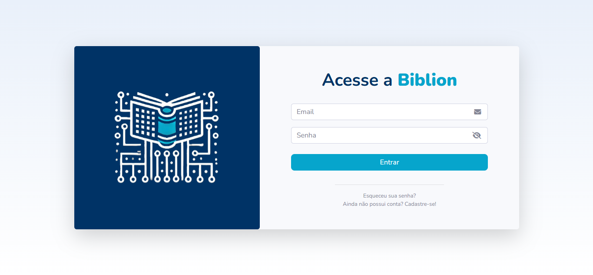
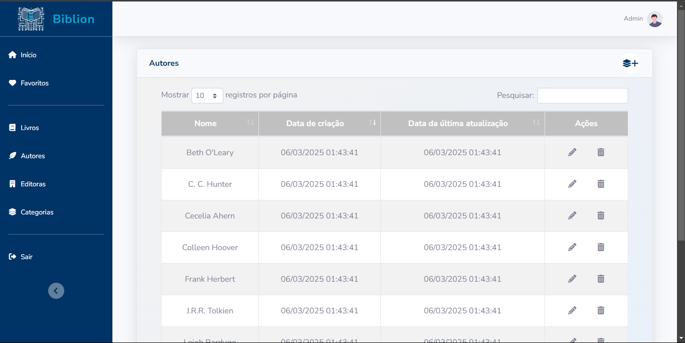

# Biblion - Biblioteca Digital

## Sumário

- [Descrição](#descrição)
- [Funcionalidades](#funcionalidades)
  - [Usuário Comum](#usuário-comum)
  - [Administrador](#administrador)
- [Tecnologias Utilizadas](#tecnologias-utilizadas)
- [Estrutura das Telas](#estrutura-das-telas)
- [Configuração e Execução](#configuração-e-execução)
  - [Clonando o Repositório](#clonando-o-repositório)
  - [Criando e Ativando o Ambiente Virtual](#criando-e-ativando-o-ambiente-virtual)
  - [Instalando Dependências](#instalando-dependências)
  - [Configurando Variáveis de Ambiente](#configurando-variáveis-de-ambiente)
  - [Executando a Aplicação](#executando-a-aplicação)
  - [Usuário Administrador Padrão](#usuário-administrador-padrão)
- [Capturas de Tela](#capturas-de-tela)
- [Licença](#licença)

## Descrição

Biblion é uma biblioteca digital desenvolvida utilizando Flask, permitindo que usuários explorem livros por categorias, favoritem obras e iniciem leituras diretamente na plataforma. Além disso, permite aos usuários com privilégio o gerenciamento de categorias, autores, editoras e livros da biblioteca.

## Funcionalidades

### Usuário Comum

- Cadastro 
- Login
- Exploração de livros separados por categorias (gêneros)
- Visualização dos detalhes de um livro específico
- Leitura de livros diretamente no sistema
- Gerenciamento de livros favoritos
- Edição de informações de perfil e senha

### Administrador

- Todas as funcionalidades do usuário comum
- Gerenciamento de categorias
- Gerenciamento de autores
- Gerenciamento de editoras
- Gerenciamento de livros

## Tecnologias Utilizadas

- **Back-end**: Flask, Flask-Login, Flask-SQLAlchemy, Flask-Migrate, Flask-Bcrypt
- **Front-end**: Jinja, SB Admin Template, CSS, JavaScript
- **Banco de Dados**: SQLite (para desenvolvimento)

## Estrutura das Telas
1. **Tela de Boas Vindas**:  Apresenta simples mensagem de boas-vindas e botões de redirecionamento para cadastro e login.

2. **Tela de Cadastro**: Permite que novos usuários se registrem na plataforma fornecendo nome, email e senha.

3. **Tela de Login**: Permite a autenticação do usuário na plataforma e o acesso às demais funcionalidades do sistema.

2. **Tela Home**: Exibe os livros separados por categorias.

3. **Tela de Detalhes do Livro**: Apresenta informações detalhadas sobre o livro e permite iniciar a leitura ou adicioná-lo aos favoritos.

4. **Tela de Leitura**: Espaço para a leitura digital do livro.

5. **Tela de Favoritos**: Lista os livros favoritados pelo usuário, permitindo acesso rápido à leitura e remoção de favoritos.

6. **Tela de Perfil**: Permite edição de dados do usuário e alteração de senha.

7. **Tela de Categorias**: Lista e permite o gerenciamento (cadastro, edição e exclusão) de categorias de livros da plataforma.

8. **Tela de Autores**: Lista e permite o gerenciamento (cadastro, edição e exclusão) de autores de livros da plataforma.

9. **Tela de Editoras**: Lista e permite o gerenciamento (cadastro, edição e exclusão) de editoras de livros da plataforma.

10. **Tela de Livros** Lista e permite o gerenciamento (cadastro, edição e exclusão) de livros da plataforma.


## Configuração e Execução

### Clonando o Repositório

```sh
git clone https://github.com/luc4svale/biblion.git
cd biblion
```

### Criando e Ativando o Ambiente Virtual

```sh
# Windows
python -m venv venv
venv\Scripts\activate

# Linux/Mac
python3 -m venv venv
source venv/bin/activate
```


### Instalando Dependências
```sh
pip install -r requirements.txt
```

### Configurando Variáveis de Ambiente
```sh
# Windows (PowerShell)
copy .env.example .env
copy .flaskenv.example .flaskenv

# Linux/Mac
cp .env.example .env
cp .flaskenv.example .flaskenv
```
Edite os arquivos .env e .flaskenv conforme necessário.

### Executando a Aplicação

```sh 
$ flask db upgrade  # Executa as migrações do banco de dados
$ flask run         # Inicia o servidor Flask
```
A aplicação estará acessível em http://127.0.0.1:5000.

### Usuário Administrador Padrão

A migração do banco de dados cria automaticamente um usuário administrador padrão com as seguintes credenciais:

- E-mail: admin@example.com
- Senha: Admin123@

Esse usuário pode ser utilizado para acessar a área administrativa do sistema.

## Capturas de Tela

### Tela de Boas Vindas


### Tela de Cadastro


### Tela de Login


### Tela Home


### Tela de Detalhes do Livro


### Tela de Leitura


### Tela de Favoritos


### Tela de Perfil


### Tela de Categorias


### Tela de Autores


### Tela de Editoras


### Tela de Livros


## Licença
Este projeto está licenciado sob a [MIT License](./LICENSE).


